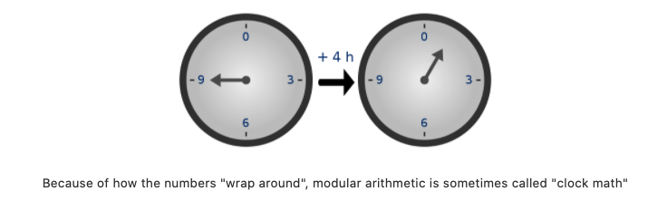

# Numbers, Fields, and Complexity in Cryptography and ZKPs

## Introduction — why this topic matters in ZKPs or cryptography
Understanding **numbers, fields, and complexity theory** is foundational for cryptography and **zero-knowledge proofs (ZKPs)**. Finite fields provide **secure, precise arithmetic**, modular arithmetic enables **efficient cryptographic operations**, and complexity theory guides the design of protocols that are both **secure and tractable**. Groups and fields underpin elliptic curve cryptography, and computational hardness assumptions support zero-knowledge proofs.

## Explanation

### Numbers and Terminology
- **Integers ($\mathbb{Z}$):** {..., -3, -2, -1, 0, 1, 2, 3, ...}  
- **Rational Numbers ($\mathbb{Q}$):** fractions $\frac{a}{b}$ with $b \neq 0$  
- **Real Numbers ($\mathbb{R}$):** all decimal numbers, including irrationals  
- **Finite Fields ($\mathbb{F}$):** Fields are denoted by $\mathbb{F}$ or $\mathbb{K}$. Examples include the real numbers $\mathbb{R}$ and the complex numbers $\mathbb{C}$. For a prime $p$, the set $\mathbb{Z}_p$ forms a field, and its nonzero elements $\mathbb{Z}_p^*$ form a multiplicative group with inverses.

Finite fields are used in cryptography because they have **short, exact representations** and support arithmetic operations with well-defined inverses.

### Modular Arithmetic
Modular arithmetic computes the **remainder** after division:

$$
n \bmod k = \text{remainder when $n$ is divided by $k$}
$$

Examples:

$$
25 \bmod 3 = 1
$$

$$
15 \bmod 4 = 3
$$

The remainder is always taken as **positive**.

### Group Theory
A **group** $(G, \cdot)$ is a set $G$ with a binary operation $\cdot$ satisfying:

1. **Closure:** $\forall a,b \in G, a \cdot b \in G$  
2. **Associativity:** $(a \cdot b) \cdot c = a \cdot (b \cdot c)$  
3. **Identity element:** $\exists e \in G: e \cdot a = a \cdot e = a$  
4. **Inverse element:** $\forall a \in G, \exists a^{-1} \in G: a \cdot a^{-1} = e$  

- **Subgroups:** subsets of $G$ that also satisfy group properties  
- **Cyclic groups:** a group with a **generator** $g$ such that repeated application of the operation generates all elements

### Fields
A **field** $(F, +, \cdot)$ has addition and multiplication with the following axioms:

1. **Associativity:** $a + (b + c) = (a + b) + c$, $a \cdot (b \cdot c) = (a \cdot b) \cdot c$  
2. **Commutativity:** $a + b = b + a$, $a \cdot b = b \cdot a$  
3. **Identities:** $0$ for addition, $1$ for multiplication, $a + 0 = a$, $a \cdot 1 = a$ 
4. **Additive Inverses:** For every \(a \in F\), there exists an element in \(F\), denoted **-a**, called the **additive inverse** of \(a\), such that: \[a + (-a) = 0\]
5. **Multiplicative Inverses:** For every \(a \neq 0 \in F\), there exists an element in \(F\), denoted **a⁻¹**, called the **multiplicative inverse** of \(a\), such that:\[a \cdot a^{-1} = 1\]
6. **Distributivity:** $a \cdot (b + c) = a \cdot b + a \cdot c$

#### Finite Fields and Generators
- A **finite field** $\mathbb{F}_p$ has $p$ elements: $\{0,1,...,p-1\}$  
- The **order** of the field is the number of elements  
- Every finite field has a **generator** $g$ such that:

$$
\{g^0, g^1, g^2, ..., g^{p-1}\} = \mathbb{F}_p^*
$$

Example: $\mathbb{F}_5 = \{0,1,2,3,4\}$, generator $2$:  

$$
2^1 = 2, \quad 2^2 = 4, \quad 2^3 = 3, \quad 2^4 = 1
$$

### Complexity Theory
Complexity theory studies **time and space requirements** to solve computational problems.  

- **Decision problem:** answers are yes/no  
- **Class P:** problems solvable in **polynomial time**  
- **Class NP:** problems whose **solutions can be verified** in polynomial time  
- **NP-Complete:** hardest problems in NP; solving one efficiently solves all NP problems  
- **NP-Hard:** at least as hard as NP-Complete; may not be in NP

#### Example: Travelling Salesman Problem
- Small $n$ (3 cities): try all permutations, feasible  
- Large $n$: number of permutations grows factorially, unfeasible  
- Time grows with input size $n$, illustrating **problem hardness**

### Interactive Proofs (IP)
- **Interactive Proofs** are central in ZKPs  
- A prover and verifier interact to **prove statements without revealing secrets**  
- IP class connects **complexity theory** with **zk-proof systems**  

Example: Goldreich, MiCali, and Wigderson show:

> Every language that admits an interactive proof can also admit a **computational zero-knowledge interactive proof**, assuming secure probabilistic encryption.

### Tables — Number and Complexity Summary

| Concept | Symbol | Description | Role in Cryptography/ZKPs |
|---------|--------|------------|---------------------------|
| Integers | $\mathbb{Z}$ | Whole numbers | Basic arithmetic operations |
| Rationals | $\mathbb{Q}$ | Fractions | Represent ratios, rational computations |
| Reals | $\mathbb{R}$ | All decimal numbers | Continuous values in theory |
| Finite Field | $\mathbb{F}_p$ | Integers modulo prime | Cryptographic operations with inverses |
| Group | $(G, \cdot)$ | Set + operation satisfying axioms | Basis for ECC and other protocols |
| Cyclic Group | - | Generated by a single element | Efficient exponentiation, Diffie-Hellman |
| P | - | Polynomial-time solvable problems | Efficiently computable tasks |
| NP | - | Solutions verifiable in poly-time | Verifiable statements in zk-systems |
| NP-Complete | - | Hardest in NP | Basis for hardness assumptions |
| NP-Hard | - | At least as hard as NP-Complete | Security assumptions for cryptography |
| Interactive Proof | IP | Prover-verifier communication | Core model for ZKPs |

## Key Takeaways
- **Finite fields** provide exact arithmetic and support cryptography.  
- **Modular arithmetic** enables operations suitable for cyclic groups.  
- **Groups and cyclic groups** underpin elliptic curve cryptography.  
- **Complexity classes** (P, NP, NP-Complete, NP-Hard) explain problem tractability.  
- **Interactive proofs** allow secure, zero-knowledge verification of statements.  
- These mathematical foundations ensure **security, efficiency, and privacy** in ZKP systems.

---

# Big O Notation

## Introduction
Understanding **Big O notation** is crucial for evaluating the efficiency of algorithms and zero-knowledge proof (ZKP) systems. It allows us to describe how **time or space requirements** grow as the size of the input increases, which is vital for designing scalable cryptographic protocols.

## Explanation

### What is Big O?
**Big O notation** expresses the **upper bound** on the time or space complexity of an algorithm. It captures how the resource usage grows **in the worst case** as a function of input size $$n$$.

- Example: An algorithm with complexity $$O(n^2)$$ means that if the input size doubles, the time required roughly quadruples.

Mathematically, if a function $$f(n)$$ represents the time taken for input size $$n$$, we write:  

$$
f(n) = O(g(n))
$$

where $$g(n)$$ is a simpler function (like $$n$$, $$n^2$$, $$\log n$$) representing the growth rate.

### Why Big O Matters in ZKPs
In **ZKP systems**, we often deal with large proofs, circuits, or cryptographic operations. Big O notation helps us:

1. Compare different proof systems (e.g., zkSNARKs vs zkSTARKs).  
2. Predict how computation or proof verification scales as **problem size increases**.  
3. Identify bottlenecks in cryptographic constructions.

### Examples

- **Linear Complexity:** $$O(n)$$  
  Doubling input doubles the work.
  
- **Quadratic Complexity:** $$O(n^2)$$  
  Doubling input quadruples the work.

- **Logarithmic Complexity:** $$O(\log n)$$  
  Increasing input size has a mild effect on time.

#### Example in ZKP
Suppose a ZKP circuit has $$n$$ constraints.  
- A naive verification may take $$O(n^2)$$ time.  
- An optimized zkSNARK protocol may reduce verification to $$O(\log n)$$.

~~~~
# Pseudocode example
for i in 1..n:
    for j in 1..n:
        check_constraint(i, j)  # O(n^2) complexity
~~~~

## Tables

| Growth Type | Big O | Example Scenario |
|------------|-------|----------------|
| Constant | O(1) | Check a single proof element |
| Logarithmic | O(log n) | Optimized verification of proof |
| Linear | O(n) | Verify n constraints sequentially |
| Quadratic | O(n^2) | Nested loop over n circuit elements |
| Cubic | O(n^3) | Multi-level combinatorial checks |

## Key Takeaways

- **Big O notation** describes the **upper bound** of algorithmic complexity.  
- It focuses on **worst-case growth** relative to input size $$n$$.  
- Essential for **analyzing ZKP performance** and scaling cryptographic systems.  
- Helps identify **efficient vs inefficient** operations in proof generation and verification.

---

# Elliptic Curves

## Introduction — why this topic matters in ZKPs or cryptography
**Elliptic curves** are foundational in modern cryptography, including **zero-knowledge proofs (ZKPs)**. They allow us to perform secure operations like key exchange, digital signatures, and polynomial commitments efficiently. Their algebraic structure ensures strong security while keeping computation manageable.

## Explanation

### What is an Elliptic Curve?
An **elliptic curve** is a set of points $P = (x, y)$ satisfying an equation such as:

$$
y^2 = x^3 + ax + b
$$

where $a$ and $b$ are constants. In addition to these points, there is an **identity element** called the **point at infinity**.

Certain elliptic curves satisfy the **group axioms**:

1. **Closure:** Every two points can be added to produce a third point.  
2. **Commutativity:** The order of addition does not matter.  
3. **Associativity:** The sum of multiple points does not depend on grouping.  
4. **Identity element:** There exists a unique point that acts as zero under addition.  

### Point Addition
The **point addition** operation combines two points on the curve to produce another point on the curve. Geometrically:

- Draw a line through two points on the curve.  
- The line intersects the curve at a third point.  
- Reflect that point over the x-axis to get the sum.  

This operation allows us to define **scalar multiplication**, the basis of elliptic curve cryptography.

~~~~
# Mermaid diagram: point addition
graph TD
A[Point P] --> C[Sum P+Q]
B[Point Q] --> C
~~~~

### Families of Elliptic Curves
We often use two main families:

#### Montgomery Curves
General form:  

$$
y^2 = x^3 + Ax^2 + x
$$

- Example: **Curve25519**  

$$
y^2 = x^3 + 486662x^2 + x
$$

- Security: 128-bit  
- Usage: Diffie–Hellman key exchange (ECDH)  
- Other curves: **BN254 / BN_128** (Ethereum zkSNARKs), **BLS12-381** (ZCash)

#### Edwards Curves
General form:  

$$
x^2 + y^2 = 1 + dx^2y^2
$$

- Special case: $a=1$  
- If $a \neq 1$: **Twisted Edwards Curves**  
- Equivalent to Montgomery curves via birational transformation

### Scalar Multiplication
**Scalar multiplication** is repeated addition of a point:

$$
[k]P = \underbrace{P + P + \dots + P}_{k \text{ times}}
$$

Where $k$ is a scalar and $+$ is point addition. This operation underlies most elliptic curve cryptography operations.

### Roots of Unity
Over a finite field $\mathbb{F}_p$, an elliptic curve has a finite number of points, including the **identity element** $O$.  

- **Roots of unity** are points $P$ such that:

$$
[n]P = O
$$

- $n$ is the **order of the point** $P$  
- Essential for cyclic subgroups used in ZKPs

### Pairings
**Pairings** are bilinear maps used in advanced ZKP techniques (KZG commitments, BLS signatures):

$$
e: G_1 \times G_2 \rightarrow G_T
$$

where $G_1, G_2, G_T$ are groups of prime order $p$.  

Properties:

1. **Non-degeneracy:** $e(P, Q) \neq 1$ for all non-zero points  
2. **Bilinearity:**  

$$
e(aP, bQ) = e(P, Q)^{ab}
$$

#### Use in ZKPs
Pairings allow verification of arithmetic relationships without revealing inputs, crucial for **verifying computations on circuits**.

~~~~
# Example: verifying a pairing relationship
P --> Q
Q --> R
R --> S[Check e(P,Q) = e(R,S)]
~~~~

## Tables

| Concept | Definition | Example / Usage |
|---------|------------|----------------|
| Elliptic Curve | Set of points $(x, y)$ satisfying $y^2 = x^3 + ax + b$ | Curve25519, BLS12-381 |
| Point Addition | Combines two points on the curve | $P + Q = R$ |
| Scalar Multiplication | Repeated point addition | $[k]P$ |
| Roots of Unity | Points returning to identity after repeated addition | $[n]P = O$ |
| Pairings | Bilinear map between groups | $e: G_1 \times G_2 \to G_T$ |

## Key Takeaways

- **Elliptic curves** provide a group structure enabling cryptographic operations.  
- **Point addition** and **scalar multiplication** are fundamental operations.  
- **Roots of unity** define cyclic subgroups used in ZKPs.  
- **Pairings** allow verification of arithmetic relations in proofs without revealing secrets.  
- Different **curve families** (Montgomery, Edwards) offer trade-offs in performance and security.

---

# Polynomials in Cryptography and ZKPs

## Introduction — why this topic matters in ZKPs or cryptography
**Polynomials** are central in cryptography and **zero-knowledge proofs (ZKPs)** because they can compactly encode large amounts of information. For instance, a single polynomial equation can represent an unbounded set of equations between numbers. Polynomials enable efficient **commitments, evaluations, and verifications** in zk proving systems.

## Explanation

### What is a Polynomial?
A **polynomial** is an expression built from constants and variables using **addition**, **multiplication**, and **exponentiation to non-negative integers**.  

Example:

$$
P(x) = 3x^3 + 2x^2 - 5x + 7
$$

Vitalik Buterin notes:

> "Polynomials are a single mathematical object that can contain an unbounded amount of information (think of them as a list of integers). A single equation between polynomials can represent an unbounded number of equations between numbers."

For example, if:

$$
A(x) + B(x) = C(x)
$$

then this implies:

$$
\begin{align}
A(0)+B(0) &= C(0) \\
A(1)+B(1) &= C(1) \\
A(2)+B(2) &= C(2) \\
A(3)+B(3) &= C(3) \\
&\dots
\end{align}
$$

### Adding, Multiplying, and Dividing Polynomials
Polynomials can be combined using:

- **Addition:** Combine coefficients of the same degree  
- **Multiplication:** Distribute terms across polynomials  
- **Division:** Factor polynomials if a root is known  

Example: If a polynomial $P(x)$ has a root $r$, we can factor it as:

$$
P(x) = (x - r) Q(x)
$$

where $Q(x)$ is a polynomial of one degree lower.

### Roots of Polynomials
For a polynomial $P(x)$ over a field $\mathbb{F}$, a **root** is an element $r \in \mathbb{F}$ such that:

$$
P(r) = 0
$$

- If $r$ is a root, $P(x)$ is divisible by $(x - r)$.  
- Polynomial long division allows factoring when roots are known.

### Schwartz-Zippel Lemma
A key property of polynomials:

> "Different polynomials are different at most points."

Formally, if $P(x)$ and $Q(x)$ are distinct polynomials of degree at most $d$, then they intersect at no more than $d$ points.  

- **Equal polynomials:** Evaluate to the same value at all points or have identical coefficients.  
- **Non-equal polynomials:** For most inputs, $P(x) \neq Q(x)$, especially in large finite fields.

**Example:** Over a finite field of size $p$:

$$
x^p - x = 0 \quad \forall x \in \mathbb{F}_p
$$

Polynomials $x^p - x$ and $0$ take the same values at all points but have different coefficients.

### Lagrange Interpolation
Given a set of $n$ points, **Lagrange interpolation** produces a unique polynomial of degree $n-1$ passing through all points.

- **2 points:** Single straight line  
- **3 points:** Single quadratic curve  
- **n points:** Polynomial of degree $n-1$

This is useful in ZKPs for constructing polynomials that encode secret values or evaluations.

### Polynomial Representations
Polynomials can be represented in two main ways:

1. **Coefficient form:** List of coefficients  
   $$
   P(x) = a_0 + a_1 x + a_2 x^2 + \dots + a_n x^n
   $$
2. **Point-value form:** List of points $(x_i, P(x_i))$  

Conversion between forms:

- **Evaluation:** Coefficient → Point-value  
- **Interpolation:** Point-value → Coefficient

## Tables

| Concept | Definition | Example / Usage |
|---------|------------|----------------|
| Polynomial | Expression with variables and constants | $3x^3 + 2x^2 - 5x + 7$ |
| Root | Value where polynomial evaluates to 0 | $r$ s.t. $P(r)=0$ |
| Factorization | Express polynomial in terms of roots | $P(x) = (x-r)Q(x)$ |
| Schwartz-Zippel | Polynomials differ at most $d$ points | Detect equality efficiently in large fields |
| Lagrange Interpolation | Polynomial passing through given points | Constructing secret-sharing polynomials |
| Representations | Coefficient form or point-value form | Switch via evaluation/interpolation |

## Key Takeaways

- **Polynomials encode unbounded information** in a compact mathematical form.  
- **Roots and factorization** are essential for dividing and manipulating polynomials.  
- **Schwartz-Zippel lemma** ensures distinct polynomials rarely collide on large fields.  
- **Lagrange interpolation** allows constructing polynomials through given points.  
- **Two representations** (coefficient vs point-value) enable flexible computation in ZKPs.

---

# Transformations in Zero-Knowledge Proofs

## Introduction — why this topic matters in ZKPs or cryptography
**Transformations** are at the heart of many **zero-knowledge proof (ZKP)** protocols. They allow a **prover** to convert a statement into forms that can be efficiently verified by a **verifier**, often using **polynomials**. Ensuring that these transformations preserve truth while preventing cheating is critical for the security of ZKPs.

## Explanation

### The Concept of Transformations
In ZKPs, the prover starts with a statement, for example:

> "I know the square root of 25."

This statement is then **transformed** into a mathematical form suitable for verification, usually involving **polynomials**. Each transformation must maintain correctness and prevent the prover from cheating.

### Polynomials in ZKPs
Polynomials provide a convenient representation for ZKP statements. The verification process often works as follows:

1. The **verifier** knows a polynomial $V(x)$.  
2. The verifier chooses a **random value** $r$ and computes $V(r)$.  
3. The **prover** is asked to evaluate their claimed polynomial $P(x)$ at $r$.  
4. The prover returns $P(r)$ to the verifier.  
5. The verifier checks if $P(r) = V(r)$. If so, the statement is likely correct.

This protocol allows the verifier to confirm knowledge of a polynomial **without revealing it fully**, providing **high confidence** in the prover's claim.

### Polynomial Commitment Schemes
In practice, **polynomial commitment schemes** are used to efficiently manage these checks:

- They allow the prover to **commit** to a polynomial without revealing it.  
- Later, the prover can **prove evaluations at specific points** without exposing the entire polynomial.  
- The verifier can **trust the evaluation** because it is tied to the original commitment.

### Zero Polynomials and Factorization
A fundamental rule in ZKPs:

> If a polynomial $P(x)$ is zero across a set $S = \{x_1, x_2, ..., x_n\}$, then it can be expressed as:

$$
P(x) = Q(x) \cdot Z_S(x)
$$

where:

- $Q(x)$ is another polynomial  
- $Z_S(x) = (x-x_1)(x-x_2)\dots(x-x_n)$ is the **lowest-degree polynomial that vanishes on $S$**

This ensures that any polynomial which is zero on a set is a **multiple of the minimal zero polynomial** for that set.

### Random Evaluation and Soundness
A key mathematical insight:

- Over a sufficiently large field, evaluating polynomials at a **random point $r$** can serve as a **probabilistic check** for correctness.
- If a property holds for a polynomial at a **random $r$**, it is overwhelmingly likely to hold **for the entire polynomial**.

**Example:** Suppose for a polynomial $P(x)$:

$$
P(r) = 0
$$

for a randomly chosen $r$. Then, with high probability:

$$
P(x) = 0 \quad \text{for all relevant } x
$$

This principle underlies the **soundness** of many ZKP schemes, making random evaluation a powerful verification tool.

## Tables

| Concept | Purpose in ZKPs | Key Insight |
|---------|----------------|------------|
| Transformation | Convert statements into verifiable forms | Must preserve correctness and prevent cheating |
| Polynomial Evaluation | Check prover's claim | Evaluate at a random $r$ for high-confidence verification |
| Polynomial Commitment | Commit without revealing | Enables secure, selective proof of evaluations |
| Zero Polynomial Factorization | Represent zeros compactly | $P(x) = Q(x) \cdot Z_S(x)$ ensures structure over sets |
| Random Point Soundness | Probabilistic correctness | One check at random $r$ suffices for high confidence |

## Key Takeaways

- **Transformations** convert statements into forms that are easy to verify.  
- **Polynomials** are central in ZKPs, enabling compact and verifiable representations.  
- **Random evaluation** allows efficient, probabilistic verification of polynomials.  
- **Polynomial commitments** provide security without revealing full information.  
- **Zero polynomial factorization** ensures that polynomials vanishing on a set have a predictable structure.

---

# Polynomial Commitment Schemes

## Introduction — why this topic matters in ZKPs or cryptography
**Polynomial Commitment Schemes (PCS)** are crucial in **zero-knowledge proofs (ZKPs)** because they allow a **prover** to commit to a polynomial and later prove **evaluations at specific points** without revealing the full polynomial. This ensures **succinctness** and **security** in ZKP protocols, especially when polynomials have many terms.

## Explanation

### Commitment Schemes Overview
A **commitment scheme** has two fundamental properties:

1. **Binding:** Once a commitment $C$ is published, it is computationally hard to find another pair $(m', r')$ such that the new commitment equals $C$. This guarantees **no ambiguity**.  
2. **Hiding:** Given $C$, it is computationally hard to extract information about the committed message $m$. This ensures **privacy**.

### Polynomial Commitments
A **polynomial commitment** is a compact object that represents a polynomial $P(x)$ and allows verification of evaluations **without revealing the full polynomial**:

- A prover sends a commitment $C$ representing $P(x)$.  
- For a specific point $r$, the prover can provide a proof that convinces the verifier of the value $P(r)$.

This enables the verifier to check polynomial equations efficiently:

1. Commit to all polynomials used in a ZKP.  
2. Generate proofs of their evaluations at specific points.  
3. Verify the equations using the evaluations, instead of the full polynomials.

### Efficient Implementations
One common approach is to organize **polynomial evaluations in a Merkle tree**:

- Each **leaf** represents an evaluation at a specific point.  
- The verifier can **randomly select leaves** and check **Merkle proofs** for membership.  
- This reduces the amount of data transmitted while maintaining security.

### Role in ZKPs
Polynomials in ZKPs can have **thousands or millions of terms**. PCS helps:

- Reduce the **communication overhead** between prover and verifier.  
- Maintain **succinctness**: proofs remain small even for large polynomials.  
- Ensure **verifiability** without exposing the entire polynomial.

### Types of Polynomial Commitment Schemes
Different PCS constructions exist, each with its own **underlying assumptions**:

- **Kate Commitments / KZG:** Based on **pairing-based cryptography**.  
- **Pedersen Commitments:** Based on **discrete logarithm assumptions**.  
- **Merkle-based Commitments:** Use **hash functions** to commit to evaluations.

### Comparison of Schemes

| Scheme | Security Assumption | Proof Size | Verification Time | Notes |
|--------|------------------|------------|-----------------|------|
| **KZG / Kate** | Pairing-based | Constant | Constant | Widely used in zkSNARKs |
| **Pedersen** | Discrete log | Linear | Linear | Hiding property strong |
| **Merkle-based** | Collision-resistant hash | Logarithmic | Logarithmic | Simple, post-quantum secure |

## Key Takeaways

- **Binding** and **hiding** are essential properties of any commitment scheme.  
- Polynomial commitments allow **succinct proofs** for very large polynomials.  
- They enable verifiers to check **specific evaluations** without knowing the full polynomial.  
- **Merkle trees** or **pairing-based schemes** are commonly used to implement PCS.  
- PCS is a cornerstone for **efficient and secure ZKPs**, especially for large-scale computations.

---

# Use of Polynomials for Error Correction

## Introduction — why this topic matters in ZKPs or cryptography
Polynomials are not only useful for representing computations in **zero-knowledge proofs (ZKPs)**, but also play a central role in **error detection and correction**. In **STARKs** and other ZKP systems, polynomials allow the encoding of computation traces in a way that **amplifies errors**, making it easier to detect inconsistencies without revealing private data.

## Explanation

### Polynomial Encoding for Error Correction
To protect data against errors, we can encode a message using **polynomial arithmetic over a finite field**:

1. Represent the message as coefficients of a polynomial $P(x)$ of degree $d$:  

$$
P(x) = a_0 + a_1 x + a_2 x^2 + \dots + a_d x^d
$$

2. Evaluate this polynomial at **additional points** $x_1, x_2, \dots, x_n$ (where $n > d$) to introduce **redundancy**.  
3. These extra evaluations form **error-correcting codes**, specifically **Reed-Solomon codes**, which allow detection and correction of errors in the data.

### Fast Evaluation Using FFT
Computing evaluations for many points can be slow. **Fast Fourier Transform (FFT)** allows rapid evaluation of polynomials at multiple points simultaneously:

~~~~
# Pseudo-code for FFT-based evaluation
FFT(P, points) -> evaluations
~~~~

This speeds up encoding and verification in ZKP systems.

### Error Amplification in ZKPs
In **STARKs**, computations are first **arithmetized**:

1. Execution traces of the computation are converted into **polynomial equations**.  
2. These polynomials are **encoded using Reed-Solomon codes**, producing a larger set of evaluation points.  
3. Any small error in the original computation gets **spread and magnified** across the encoded polynomial, making inconsistencies easier to detect.

This process ensures that **even tiny mistakes become detectable**, which is critical for the soundness of ZKPs.

### Visualization of the Process
~~~~
mermaid
flowchart LR
    A[Original Message] --> B[Polynomial Representation P(x)]
    B --> C[Reed-Solomon Encoding]
    C --> D[Extended Evaluation Points x1, x2, ..., xn]
    D --> E[Error Amplification]
    E --> F[Verification in ZKP]
~~~~

### Example
Suppose we have a message with coefficients $(2, 3, 1)$ forming the polynomial:

$$
P(x) = 2 + 3x + x^2
$$

We evaluate it at $x = 0, 1, 2, 3, 4$ (more points than degree $d=2$). The extra points introduce redundancy. If any evaluation is inconsistent, we know the polynomial—and thus the computation—contains an error.

## Tables — Reed-Solomon Encoding

| Step | Description | Purpose |
|------|------------|---------|
| 1 | Represent message as polynomial | Converts data into algebraic form |
| 2 | Choose evaluation points $x_1, ..., x_n$ | Adds redundancy |
| 3 | Evaluate polynomial at all points | Generates codeword |
| 4 | Detect/Amplify errors | Ensures soundness in ZKPs |
| 5 | Verify using selected points | Efficient checking without revealing data |

## Key Takeaways
- Polynomials can encode messages for **error correction** using **Reed-Solomon codes**.  
- Evaluating polynomials at additional points adds **redundancy** that amplifies errors.  
- **Fast Fourier Transform (FFT)** allows efficient computation of multiple evaluations.  
- In ZKPs, this mechanism ensures that even small errors in computation become **easily detectable**.  
- Error amplification is a **critical step** in maintaining the integrity of STARK-based proofs.

---

# Inner Product Argument in Zero-Knowledge Proofs

## Introduction — why this topic matters in ZKPs or cryptography
The **inner product argument** is a crucial technique in **zero-knowledge proofs (ZKPs)**, particularly in systems like **Bulletproofs**. It allows a prover to convince a verifier that a vector commitment satisfies certain properties, such as being the inner product of two vectors, without revealing the vectors themselves. This ensures **succinctness** and **privacy** in cryptographic proofs.

## Explanation

### Inner Product in Linear Algebra
The **inner product** generalizes the **dot product** in Euclidean spaces. Given two vectors:

$$
\mathbf{a} = (a_1, a_2, \dots, a_n), \quad \mathbf{b} = (b_1, b_2, \dots, b_n)
$$

the inner product is defined as:

$$
\langle \mathbf{a}, \mathbf{b} \rangle = \sum_{i=1}^n a_i b_i
$$

It measures:
- **Similarity** between vectors
- **Length** of vectors (when taken with itself)
- **Angle** between vectors (orthogonality if inner product is zero)

### Inner Product as Polynomial Evaluation
If we define a vector:

$$
\mathbf{b} = (1, x, x^2, \dots, x^{n-1})
$$

then the inner product:

$$
\langle \mathbf{a}, \mathbf{b} \rangle = a_1 + a_2 x + a_3 x^2 + \dots + a_n x^{n-1}
$$

is equivalent to **evaluating a polynomial** at $x$. This connection is fundamental in ZKPs, as it allows polynomial-based commitments.

### Pedersen Commitments and Vectors
In ZKPs, we often work over an elliptic curve with points $G$ and $H$. For scalars $a, b$, a **Pedersen commitment** is:

$$
C = a \cdot G + b \cdot H
$$

This is **binding and hiding**, meaning no other $(a', b')$ will produce the same commitment.  

For vectors $\mathbf{a}, \mathbf{b}$ of length $n$, the vector commitment extends naturally:

$$
C = \sum_{i=1}^n a_i G_i + \sum_{i=1}^n b_i H_i
$$

where $G_i$ and $H_i$ are base points on the curve.

### Succinct Inner Product Proof
Directly checking all vector elements is inefficient. The **inner product argument** reduces the problem step by step:

1. **Halve the vectors** $\mathbf{a}$ and $\mathbf{b}$ recursively.
2. At each step, the prover sends commitments that allow the verifier to check **compressed inner products**.
3. Continue until left with **single scalars**, which are trivial to verify.

This reduces the size of the proof from **linear in $n$** to **logarithmic in $n$**, providing **succinct proofs**.

### Visualization of the Recursive Compression
~~~~
mermaid
flowchart LR
    A[Vector Commitment C] --> B[Split Vectors a, b into halves]
    B --> C[Prover sends compressed commitments]
    C --> D[Verifier checks intermediate inner products]
    D --> E[Repeat recursively]
    E --> F[Final scalar verification]
~~~~

### Example
Suppose $\mathbf{a} = (3, 2, 5, 1)$ and $\mathbf{b} = (1, 4, 2, 3)$. The inner product:

$$
\langle \mathbf{a}, \mathbf{b} \rangle = 3 \cdot 1 + 2 \cdot 4 + 5 \cdot 2 + 1 \cdot 3 = 3 + 8 + 10 + 3 = 24
$$

Instead of revealing all elements, a **recursive inner product argument** can convince the verifier that the committed vectors indeed produce the inner product 24.

## Tables — Inner Product Argument Summary

| Concept | Description | Purpose in ZKPs |
|---------|------------|----------------|
| Vector $\mathbf{a}, \mathbf{b}$ | Arrays of scalars | Represent data in commitments |
| Inner product $\langle \mathbf{a}, \mathbf{b} \rangle$ | Sum of element-wise products | Shows relation between vectors |
| Pedersen commitment | $C = \sum a_i G_i + \sum b_i H_i$ | Hides vector while binding values |
| Recursive halving | Split vectors and compress proofs | Reduces proof size from $O(n)$ to $O(\log n)$ |
| Final scalar verification | Single value check | Efficient verification by the verifier |

## Key Takeaways
- The **inner product argument** is a core technique in ZKPs for **proving vector relationships** succinctly.  
- It generalizes the **dot product** and connects with **polynomial evaluation**.  
- **Pedersen commitments** allow hiding vectors while still supporting inner product proofs.  
- Recursive halving reduces **proof size logarithmically**, making ZKPs **efficient and scalable**.  
- Essential in **Bulletproofs**, enabling privacy-preserving range proofs and other vector-based statements.

---

