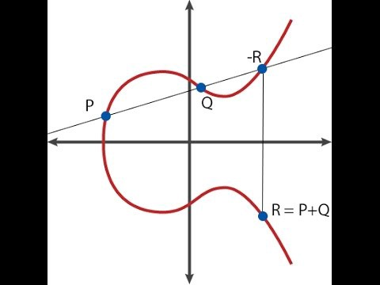

# Essential Maths for Zero Knowledge Proofs

## Laurence Kirk - Extropy.IO

These notes are available at our [website](https://maths.extropy.io) or as a single [pdf](https://bit.ly/ExtropyMathsForZK)

**Extropy.IO**

Pester me via  
- **Twitter**: @Extropy  
- **Email**: info@extropy.io  
- **Discord**: https://discord.gg/VSCHXqQE  

---

## Quote from Remco Bloemen (remco@0x.org)

> **Disclaimer: contains maths**  
>  
> If you don’t understand something:  
> - Not your fault, this stuff is hard  
> - Nobody understands it fully  
>  
> If you don’t understand anything:  
> - My fault, anything can be explained at some level  
>  
> If you do understand everything:  
> - Collect your Turing Award & Fields Medal  

### Advice
- **Don’t try to understand everything at once**  
- **Get familiar with the terminology** even if you don’t know all the details  
- **Chunk topics** into smaller areas  

---

## Numbers and Terminology

### 1. Integers
The set of **integers** is denoted by $$\mathbb{Z}$$:  

$$ \{ \dots, -4, -3, -2, -1, 0, 1, 2, 3, 4, \dots \} $$  

Integers include negative numbers, zero, and positive numbers.

---

### 2. Rational Numbers
The set of **rational numbers** is denoted by $$\mathbb{Q}$$:  

$$ \{ 1, \frac{3}{2}, 2, \frac{22}{7}, \dots \} $$  

Rational numbers are numbers that can be expressed as fractions of integers.

---

### 3. Real Numbers
The set of **real numbers** is denoted by $$\mathbb{R}$$:  

$$ \{ 2, -4, 613, \pi, \sqrt{2}, \dots \} $$  

Real numbers include both rationals and irrationals (like $$\pi$$ and $$\sqrt{2}$$).

---

### 4. Fields
- **Fields** are denoted by $$\mathbb{F}$$ if they are finite.  
- For real or complex numbers, we may use $$\mathbb{K}$$.  
- We also use $$\mathbb{Z}_p^*$$ to represent the set of integers modulo a prime $$p$$ with multiplicative inverses.  

**Why finite fields in cryptography?**  
- Elements have **short, exact representations**.  
- They have **useful algebraic properties** (inverses, closure, etc.).  

---

## Modular Arithmetic

See this [introduction](https://www.khanacademy.org/computing/computer-science/cryptography/modarithmetic/a/what-is-modular-arithmetic).

### Concept
When we write **n mod k**, it means the **remainder** when $$n$$ is divided by $$k$$.  

### Examples
- $$25 \mod 3 = 1$$  
- $$15 \mod 4 = 3$$  

The remainder should always be **positive**.

---

## Summary
- $$\mathbb{Z} $$= integers  
- $$\mathbb{Q} $$= rationals  
- $$\mathbb{R} $$= reals  
- $$ \mathbb{F} $$ = finite fields  
- Modular arithmetic is **remainder arithmetic**, essential in cryptography.  

**Key point**: Modular arithmetic and finite fields form the backbone of modern zero-knowledge proof mathematics.  

---

## Group Theory

Simply put, a **group** is a set of elements $$ \{a, b, c, \dots\} $$ plus a binary operation (denoted here as $$ \cdot $$).  

To be considered a group, this combination needs to have certain properties:

1. **Closure**  
   For all $$ a, b \in G $$, the result of the operation $$ a \cdot b $$ is also in $$ G $$.  

2. **Associativity**  
   For all $$ a, b, c \in G $$:  
   $$ (a \cdot b) \cdot c = a \cdot (b \cdot c) $$  

3. **Identity element**  
   There exists an element $$ e \in G $$ such that, for every $$ a \in G $$:  
   $$ e \cdot a = a \cdot e = a $$  
   Such an element is **unique**.  

4. **Inverse element**  
   For each $$ a \in G $$, there exists an element $$ b \in G $$, commonly denoted $$ a^{-1} $$ (or $$ -a $$ if the operation is addition), such that:  
   $$ a \cdot b = b \cdot a = e $$  

---

### Subgroups
If a subset of the elements in a group also satisfies the **group properties**, then that subset is called a **subgroup**.  

Example: The even integers form a subgroup of the integers under addition.

---

### Cyclic Groups and Generators
A **cyclic group** is a finite group that has a **generator element**.  

- Starting at the generator and repeatedly applying the group operation produces every element of the group.  

Example:  
Consider the integers mod 4 under addition: $$ \{0,1,2,3\} $$  
- Generator = 1:  
  $$ 0 + 1 = 1, \; 1 + 1 = 2, \; 2 + 1 = 3, \; 3 + 1 = 0 \ (\text{mod } 4) $$  
Thus, the group is cyclic.

---

## Fields

A **field** is a set together with two operations: **addition** and **multiplication**.  

### Examples
- Real numbers under addition and multiplication.  
- Integers mod a prime number under addition and multiplication.  

---

### Field Axioms  
Let $$ a, b, c \in \mathbb{F} $$ (a field):  

1. **Associativity** of addition and multiplication.  
2. **Commutativity** of addition and multiplication.  
3. Existence of **additive identity** (0) and **multiplicative identity** (1).  
4. Existence of **additive inverses** (for each $$ a $$, there is $$ -a $$).  
5. Existence of **multiplicative inverses** (for each $$ a \neq 0 $$, there is $$ a^{-1} $$).  
6. **Distributivity**:  
   $$ a \cdot (b + c) = (a \cdot b) + (a \cdot c) $$  

---

### Finite Fields and Generators

- **Order** = number of elements in the field.  
- Order must be a **prime** (prime field) or **power of a prime** (extension field).  
- Elements represented as integers $$ \{0, 1, \dots, p-1\} $$ when modulus is prime $$ p $$.  
- Every finite field has a **generator** (a primitive element).  

Example: Prime $$ p = 5 $$  
$$ \mathbb{Z}_5^* = \{0, 1, 2, 3, 4\} $$  

Operations are **mod 5**:  
- $$ 3 \times 4 = 12 \equiv 2 \pmod{5} $$  

This field is **cyclic** and has two generators: 2 and 3.  

---

# Complexity Theory

**Complexity theory** studies the time or space requirements to solve a problem, depending on the size of the input.

### Main Classes
- **P**: Problems solvable in **polynomial time**.  
- **NP**: Problems verifiable in **polynomial time**.  
- **NP-Complete**: The hardest problems in NP. If one can be solved in polynomial time, all can.  
- **NP-Hard**: At least as hard as NP-complete problems (may not even be in NP).  

---

### Example: Travelling Salesman Problem
- Given a list of cities and distances between them, find the shortest possible route visiting each city once and returning to the start.  
- This problem is **NP-hard**.  

---

### References
- [Classic Nintendo Games Are (Computationally) Hard](https://arxiv.org/abs/1203.1895)  
- ["Everything provable is provable in zero knowledge"](https://dl.acm.org/doi/pdf/10.5555/88314.88333)  

---

### Interactive Proofs (IP)
- **Interactive Proofs** are protocols where a prover and verifier interact to establish truth.  
- Reference: [Videos by Alessandro Chiesa](https://www.youtube.com/watch?v=pMzpQ82Q88Q)  

---

# Complexity, Elliptic Curves, and Polynomials in Cryptography

This guide introduces **Big O notation**, **elliptic curves**, **pairings**, and **polynomials** with a focus on their use in cryptography and zero-knowledge proofs (ZKPs).  

It is designed to be **beginner-friendly**, step-by-step, and full of examples, equations, and references.

---

# Big O Notation

Big O describes the **complexity** of code using algebraic terms. It tells us how the runtime or memory grows as input size increases.  

Example:  
- **$O(1)$** → Constant time (no matter input size).  
- **$O(n)$** → Linear time.  
- **$O(n^2)$** → Quadratic time. Runtime grows proportionally to the square of the input size.  

Equation example:  
$$T(n) = 5n^2 + 3n + 2 \in O(n^2)$$

Visualisation:  

Comparison of complexities in ZK proofs:  

---

# Elliptic Curves

Elliptic curves are defined by an equation:  
$$y^{2} = x^{3} + ax + b$$  

They form a **group** under a special addition rule. This makes them useful in cryptography.

## Families of Curves

1. **Montgomery Curves**  
   Equation:  
   $$y^{2} = x^{3} + 486662x^{2} + x$$  
   - Example: **Curve25519**  
   - Used in **ECDH (Diffie–Hellman)**.  
   - BN254/BN128 used in **Ethereum zkSNARKs**.  
   - BLS12-381 used in **ZCash**.  

   

2. **Edwards Curves**  
   Equation:  
   $$ax^{2}+y^{2}=1+dx^{2}y^{2}$$  
   - If **a = 1** → Edwards curve.  
   - If **a ≠ 1** → Twisted Edwards curve.  
   - They are **birationally equivalent** to Montgomery curves.  

---

## Scalar Multiplication

Scalar multiplication is the core cryptographic operation:  
$$kP = \underbrace{P + P + P + ... + P}_{k \text{ times}}$$  

It is efficient to compute but hard to reverse (Elliptic Curve Discrete Logarithm Problem).

---

## Roots of Unity

On elliptic curves, certain points repeat after multiple additions. These are called **points of finite order** (roots of unity).

---

## Visualisations

Elliptic curves are geometric objects:  

From *Serious Cryptography* (Jean-Philippe Aumasson):  

See this [video](https://www.youtube.com/watch?v=_JiPcvtr8sY) for examples of elliptic curve arithmetic.

---

# Pairing

Pairings connect two elliptic curve groups into a third group.  

Formal definition:  
$$e: \mathbb G_1 \times \mathbb G_2 \mapsto \mathbb G_T$$  

### Properties
1. **Non-degeneracy** → not always the identity.  
2. **Bilinearity** → distributes across addition:  
   $$e(aP, bQ) = e(P,Q)^{ab}$$  

### Applications
- **KZG commitments**  
- **SNARKs**  
- **BLS signatures**  

See [Vitalik’s article](https://vitalik.eth.limo/general/2017/01/14/exploring_ecp.html).

---

# Polynomial Introduction

A **polynomial** is an expression involving variables, constants, and powers:  

Example:  
$$P(x) = 3x^{2} + 4x + 3$$

**Vitalik Buterin**:  
> "Polynomials are a single mathematical object that can contain an unbounded amount of information."

---

## Operations

Reference: [Polynomial Arithmetic](https://en.wikipedia.org/wiki/Polynomial_arithmetic)  

---

## Roots and Division

- A **root** r satisfies:  
  $$P(r) = 0$$  
- If r is a root, then:  
  $$P(x) = (x-r)Q(x)$$  

---

## Schwartz-Zippel Lemma

- Two different low-degree polynomials differ **almost everywhere**.  
- Important in ZKPs for probabilistic verification.

---

## Lagrange Interpolation

Given **n points**, there exists a **unique degree n-1 polynomial** passing through them.  

---

## Representations

1. **Coefficient form**:  
   $$f(x) = a_0 + a_1x + a_2x^2 + ...$$  
2. **Point-value form**:  
   $$(x_1,y_1), (x_2,y_2), ...$$  

---

# Transformations

In **zero-knowledge proofs (ZKPs)**, statements are **transformed into polynomial checks**.  
This allows verifiers to confirm correctness securely and efficiently.

---

# Polynomials in ZKPs

Polynomials allow provers and verifiers to work with **succinct commitments**:  

- A prover claims knowledge of a polynomial.  
- The verifier checks correctness by evaluating at random points.  
- Thanks to **Schwartz-Zippel**, cheating is almost impossible.  

---

# References & Citations

- [https://maths.extropy.io](https://maths.extropy.io)  
- [https://bit.ly/ExtropyMathsForZK](https://bit.ly/ExtropyMathsForZK)  
- [https://discord.gg/VSCHXqQE](https://discord.gg/VSCHXqQE)  
- [Khan Academy: Modular Arithmetic](https://www.khanacademy.org/computing/computer-science/cryptography/modarithmetic/a/what-is-modular-arithmetic)  
- [https://asecuritysite.com/encryption/finite](https://asecuritysite.com/encryption/finite)  
- [Schwartz-Zippel Reference (arXiv)](https://arxiv.org/abs/1203.1895)  
- [Lagrange Paper (ACM)](https://dl.acm.org/doi/pdf/10.5555/88314.88333)  
- [Polynomial GIF](http://science.slc.edu/jmarshall/courses/2002/spring/cs50/BigO/polynomials.gif)  
- [ZKP Complexity Comparison](https://i.imgur.com/SH7BExt.png)  
- [Elliptic Curve Video](https://www.youtube.com/watch?v=_JiPcvtr8sY)  
- [Vitalik: Exploring EC Pairings](https://vitalik.eth.limo/general/2017/01/14/exploring_ecp.html)  
- [Polynomial Arithmetic (Wikipedia)](https://en.wikipedia.org/wiki/Polynomial_arithmetic)  
- [Lagrange Interpolation Image](https://upload.wikimedia.org/wikipedia/commons/thumb/4/41/Interpolation_example_polynomial.svg/440px-Interpolation_example_polynomial.svg.png)  

---

# List of Internal/External Links

- **Internal (local images)**:  
  - img/mont.jpeg  
  - img/Screenshot%202022-02-19%20at%2016.01.36.png  

- **External**:  
  - https://maths.extropy.io  
  - https://bit.ly/ExtropyMathsForZK  
  - https://discord.gg/VSCHXqQE  
  - https://www.khanacademy.org/computing/computer-science/cryptography/modarithmetic/a/what-is-modular-arithmetic  
  - https://asecuritysite.com/encryption/finite  
  - https://arxiv.org/abs/1203.1895  
  - https://dl.acm.org/doi/pdf/10.5555/88314.88333  
  - http://science.slc.edu/jmarshall/courses/2002/spring/cs50/BigO/polynomials.gif  
  - https://i.imgur.com/SH7BExt.png  
  - https://i.imgur.com/EnAcwOd.jpg  
  - https://www.youtube.com/watch?v=_JiPcvtr8sY  
  - https://vitalik.eth.limo/general/2017/01/14/exploring_ecp.html  
  - https://en.wikipedia.org/wiki/Polynomial_arithmetic  
  - https://upload.wikimedia.org/wikipedia/commons/thumb/4/41/Interpolation_example_polynomial.svg/440px-Interpolation_example_polynomial.svg.png  
# Complexity, Elliptic Curves, and Polynomials in Cryptography

This guide introduces **Big O notation**, **elliptic curves**, **pairings**, and **polynomials** with a focus on their use in cryptography and zero-knowledge proofs (ZKPs).  

It is designed to be **beginner-friendly**, step-by-step, and full of examples, equations, and references.

---

# Big O Notation

Big O describes the **complexity** of code using algebraic terms. It tells us how the runtime or memory grows as input size increases.  

Example:  
- **$O(1)$** → Constant time (no matter input size).  
- **$O(n)$** → Linear time.  
- **$O(n^2)$** → Quadratic time. Runtime grows proportionally to the square of the input size.  

Equation example:  
$$T(n) = 5n^2 + 3n + 2 \in O(n^2)$$

Visualisation:  

Comparison of complexities in ZK proofs:  

---

# Elliptic Curves

Elliptic curves are defined by an equation:  
$$y^{2} = x^{3} + ax + b$$  

They form a **group** under a special addition rule. This makes them useful in cryptography.

## Families of Curves

1. **Montgomery Curves**  
   Equation:  
   $$y^{2} = x^{3} + 486662x^{2} + x$$  
   - Example: **Curve25519**  
   - Used in **ECDH (Diffie–Hellman)**.  
   - BN254/BN128 used in **Ethereum zkSNARKs**.  
   - BLS12-381 used in **ZCash**.  

   

2. **Edwards Curves**  
   Equation:  
   $$ax^{2}+y^{2}=1+dx^{2}y^{2}$$  
   - If **a = 1** → Edwards curve.  
   - If **a ≠ 1** → Twisted Edwards curve.  
   - They are **birationally equivalent** to Montgomery curves.  

---

## Scalar Multiplication

Scalar multiplication is the core cryptographic operation:  
$$kP = \underbrace{P + P + P + ... + P}_{k \text{ times}}$$  

It is efficient to compute but hard to reverse (Elliptic Curve Discrete Logarithm Problem).

---

## Roots of Unity

On elliptic curves, certain points repeat after multiple additions. These are called **points of finite order** (roots of unity).

---

## Visualisations

Elliptic curves are geometric objects:  

From *Serious Cryptography* (Jean-Philippe Aumasson):  

See this [video](https://www.youtube.com/watch?v=_JiPcvtr8sY) for examples of elliptic curve arithmetic.

---

# Pairing

Pairings connect two elliptic curve groups into a third group.  

Formal definition:  
$$e: \mathbb G_1 \times \mathbb G_2 \mapsto \mathbb G_T$$  

### Properties
1. **Non-degeneracy** → not always the identity.  
2. **Bilinearity** → distributes across addition:  
   $$e(aP, bQ) = e(P,Q)^{ab}$$  

### Applications
- **KZG commitments**  
- **SNARKs**  
- **BLS signatures**  

See [Vitalik’s article](https://vitalik.eth.limo/general/2017/01/14/exploring_ecp.html).

---

# Polynomial Introduction

A **polynomial** is an expression involving variables, constants, and powers:  

Example:  
$$P(x) = 3x^{2} + 4x + 3$$

**Vitalik Buterin**:  
> "Polynomials are a single mathematical object that can contain an unbounded amount of information."

---

## Operations

Reference: [Polynomial Arithmetic](https://en.wikipedia.org/wiki/Polynomial_arithmetic)  

---

## Roots and Division

- A **root** r satisfies:  
  $$P(r) = 0$$  
- If r is a root, then:  
  $$P(x) = (x-r)Q(x)$$  

---

## Schwartz-Zippel Lemma

- Two different low-degree polynomials differ **almost everywhere**.  
- Important in ZKPs for probabilistic verification.

---

## Lagrange Interpolation

Given **n points**, there exists a **unique degree n-1 polynomial** passing through them.  

---

## Representations

1. **Coefficient form**:  
   $$f(x) = a_0 + a_1x + a_2x^2 + ...$$  
2. **Point-value form**:  
   $$(x_1,y_1), (x_2,y_2), ...$$  

---

# Transformations

In **zero-knowledge proofs (ZKPs)**, statements are **transformed into polynomial checks**.  
This allows verifiers to confirm correctness securely and efficiently.

---

# Polynomials in ZKPs

Polynomials allow provers and verifiers to work with **succinct commitments**:  

- A prover claims knowledge of a polynomial.  
- The verifier checks correctness by evaluating at random points.  
- Thanks to **Schwartz-Zippel**, cheating is almost impossible.  

---

# References & Citations

- [https://maths.extropy.io](https://maths.extropy.io)  
- [https://bit.ly/ExtropyMathsForZK](https://bit.ly/ExtropyMathsForZK)  
- [https://discord.gg/VSCHXqQE](https://discord.gg/VSCHXqQE)  
- [Khan Academy: Modular Arithmetic](https://www.khanacademy.org/computing/computer-science/cryptography/modarithmetic/a/what-is-modular-arithmetic)  
- [https://asecuritysite.com/encryption/finite](https://asecuritysite.com/encryption/finite)  
- [Schwartz-Zippel Reference (arXiv)](https://arxiv.org/abs/1203.1895)  
- [Lagrange Paper (ACM)](https://dl.acm.org/doi/pdf/10.5555/88314.88333)  
- [Polynomial GIF](http://science.slc.edu/jmarshall/courses/2002/spring/cs50/BigO/polynomials.gif)  
- [ZKP Complexity Comparison](https://i.imgur.com/SH7BExt.png)  
- [Elliptic Curve Video](https://www.youtube.com/watch?v=_JiPcvtr8sY)  
- [Vitalik: Exploring EC Pairings](https://vitalik.eth.limo/general/2017/01/14/exploring_ecp.html)  
- [Polynomial Arithmetic (Wikipedia)](https://en.wikipedia.org/wiki/Polynomial_arithmetic)  
- [Lagrange Interpolation Image](https://upload.wikimedia.org/wikipedia/commons/thumb/4/41/Interpolation_example_polynomial.svg/440px-Interpolation_example_polynomial.svg.png)  

---

# List of Internal/External Links

- **Internal (local images)**:  
  - img/mont.jpeg  
  - img/Screenshot%202022-02-19%20at%2016.01.36.png  

- **External**:  
  - https://maths.extropy.io  
  - https://bit.ly/ExtropyMathsForZK  
  - https://discord.gg/VSCHXqQE  
  - https://www.khanacademy.org/computing/computer-science/cryptography/modarithmetic/a/what-is-modular-arithmetic  
  - https://asecuritysite.com/encryption/finite  
  - https://arxiv.org/abs/1203.1895  
  - https://dl.acm.org/doi/pdf/10.5555/88314.88333  
  - http://science.slc.edu/jmarshall/courses/2002/spring/cs50/BigO/polynomials.gif  
  - https://i.imgur.com/SH7BExt.png  
  - https://i.imgur.com/EnAcwOd.jpg  
  - https://www.youtube.com/watch?v=_JiPcvtr8sY  
  - https://vitalik.eth.limo/general/2017/01/14/exploring_ecp.html  
  - https://en.wikipedia.org/wiki/Polynomial_arithmetic  
  - https://upload.wikimedia.org/wikipedia/commons/thumb/4/41/Interpolation_example_polynomial.svg/440px-Interpolation_example_polynomial.svg.png  
