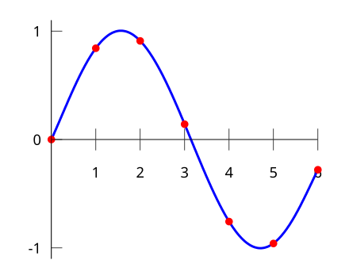

# Polynomial Introduction

A **polynomial** is an expression constructed from constants and variables using **addition**, **multiplication**, and **exponentiation to a non-negative integer power**. 

Example:

$$
3x^{2} + 4x + 3
$$

---

### Why Polynomials Matter

Vitalik Buterin notes:

> "There are many things that are fascinating about polynomials. But here we are going to zoom in on a particular one: **polynomials are a single mathematical object that can contain an unbounded amount of information**."

A **single polynomial equation** can represent an **unbounded number of equations between numbers**. For example, if:

$$
A(x) + B(x) = C(x)
$$

then this also implies:

- $$A(0) + B(0) = C(0)$$  
- $$A(1) + B(1) = C(1)$$  
- $$A(2) + B(2) = C(2)$$  
- $$A(3) + B(3) = C(3)$$  

This property is fundamental in cryptography, particularly in **zero-knowledge proofs (ZKPs)**.

---

# Adding, Multiplying, and Dividing Polynomials

In this guide, we will break down how to **add**, **multiply**, and **divide** polynomials step by step, with clear explanations, and examples.

See more: [Polynomial arithmetic](https://en.wikipedia.org/wiki/Polynomial_arithmetic)

---

A **polynomial** is an expression made up of terms that are constants multiplied by powers of a variable.

Example:

$$
P(x) = 3x^3 + 2x^2 - 5x + 7
$$

- **Coefficient**: Numbers like 3, 2, -5, 7.
- **Variable**: The letter $x$.
- **Degree**: The highest power of $x$ (here, degree = 3).
- **Constant term**: A number without a variable (here, 7).

---

## Adding Polynomials

### Rule
To add polynomials:
- **Combine like terms** (terms with the same variable and power).
- Add their coefficients.

### Example
$$
P(x) = 3x^2 + 5x + 1
$$
$$
Q(x) = 2x^2 - 3x + 4
$$

**Step 1:** Line them up by powers of $x$:
$$(3x^2 + 5x + 1) + (2x^2 - 3x + 4)$$

**Step 2:** Add coefficients of like terms:
$$(3+2)x^2 + (5-3)x + (1+4)$$

**Result:**
$$P(x) + Q(x) = 5x^2 + 2x + 5$$

**Tip:** Always align terms by their degree to avoid mistakes.

---

## Subtracting Polynomials

### Rule
To subtract polynomials:
- Distribute the minus sign.
- Then combine like terms.

### Example
$$P(x) = 4x^3 - 2x + 6$$
$$Q(x) = x^3 + 5x - 3$$

**Step 1:** Write subtraction:
$$(4x^3 - 2x + 6) - (x^3 + 5x - 3)$$

**Step 2:** Distribute the minus:
$$4x^3 - 2x + 6 - x^3 - 5x + 3$$

**Step 3:** Combine like terms:
$$(4-1)x^3 + (-2-5)x + (6+3)$$

**Result:**
$$3x^3 - 7x + 9$$

---

## Multiplying Polynomials

### Rule
Use the **distributive property**: multiply each term of one polynomial by every term of the other.

### Example (Binomial × Binomial)
$$(2x + 3)(x + 4)$$

**Step 1:** Distribute each term (FOIL method):
- First: $2x \cdot x = 2x^2$
- Outer: $2x \cdot 4 = 8x$
- Inner: $3 \cdot x = 3x$
- Last: $3 \cdot 4 = 12$

**Step 2:** Add results:
$$2x^2 + 8x + 3x + 12$$

**Step 3:** Combine like terms:
$$2x^2 + 11x + 12$$

---

### Example (Polynomial × Polynomial)
$$(3x^2 + 2x)(x^2 - x + 4)$$

Multiply each term of the first polynomial:

- $3x^2 \cdot x^2 = 3x^4$
- $3x^2 \cdot (-x) = -3x^3$
- $3x^2 \cdot 4 = 12x^2$
- $2x \cdot x^2 = 2x^3$
- $2x \cdot (-x) = -2x^2$
- $2x \cdot 4 = 8x$

**Now combine:**
$$3x^4 + (-3x^3 + 2x^3) + (12x^2 - 2x^2) + 8x$$

**Result:**
$$3x^4 - x^3 + 10x^2 + 8x$$

---

## Dividing Polynomials

### Rule
Use **long division** (like dividing numbers) or **synthetic division** (shortcut for special cases).

---

### Example (Polynomial Long Division)

Divide:
$$\frac{2x^3 + 3x^2 - x + 5}{x + 1}$$

**Step 1:** Divide first terms:
$$\frac{2x^3}{x} = 2x^2$$

**Step 2:** Multiply divisor by $2x^2$:
$$(x+1)(2x^2) = 2x^3 + 2x^2$$

**Step 3:** Subtract:
$$(2x^3 + 3x^2 - x + 5) - (2x^3 + 2x^2) = x^2 - x + 5$$

**Step 4:** Repeat process:
- Divide $x^2 / x = x$.
- Multiply: $(x+1)(x) = x^2 + x$.
- Subtract: $(x^2 - x + 5) - (x^2 + x) = -2x + 5$.

**Step 5:** Divide again:
- $-2x / x = -2$.
- Multiply: $(x+1)(-2) = -2x - 2$.
- Subtract: $(-2x + 5) - (-2x - 2) = 7$.

**Final Result:**
$$2x^2 + x - 2 + \frac{7}{x+1}$$

**Quotient:** $2x^2 + x - 2$  
**Remainder:** $7$

---

## Summary Table

| Operation | Rule | Example | Result |
|-----------|------|---------|--------|
| Addition  | Combine like terms | $(3x^2+5x+1)+(2x^2-3x+4)$ | $5x^2+2x+5$ |
| Subtraction | Distribute minus, combine like terms | $(4x^3-2x+6)-(x^3+5x-3)$ | $3x^3-7x+9$ |
| Multiplication | Distributive property (FOIL/binomial expansion) | $(2x+3)(x+4)$ | $2x^2+11x+12$ |
| Division | Polynomial long division | $\frac{2x^3+3x^2-x+5}{x+1}$ | $2x^2+x-2+\frac{7}{x+1}$ |

---

## Key Takeaways

- **Addition/Subtraction**: Combine like terms.  
- **Multiplication**: Use distributive property; be systematic to avoid missing terms.  
- **Division**: Long division works like with numbers; quotient + remainder form.  
- Always double-check by multiplying the quotient and divisor, then adding remainder.

---

## Roots of Polynomials

For a polynomial $$P(x)$$ over a field $$\mathbb{K}$$, a **root** $$r$$ satisfies:

$$P(r) = 0$$

**Divisibility**:

A polynomial $$B(x)$$ divides another polynomial $$A(x)$$ if there exists a polynomial $$C(x)$$ such that:

$$A(x) = B(x) \cdot C(x)$$

Notation: $$B | A$$

**Factoring using a root**:

If $$r$$ is a known root of a polynomial $$P(x)$$ of degree $$n$$, we can factor:

$$P(x) = (x - r) Q(x)$$

where $$Q(x)$$ is a polynomial of degree $$n-1$$ obtained from polynomial division.

---

## Schwartz-Zippel Lemma

This lemma provides a probabilistic guarantee about polynomials:

- If two polynomials $f$ and $g$ of degree at most $d$ are **not equal**, they can intersect at **no more than $d$ points**.
- In large fields, two low-degree polynomials are either **identical** or **different almost everywhere**.

Example visualization:

- If $f(x) = g(x)$ for all $x$, polynomials are equal.
- If $f(x) \neq g(x)$ for almost all $x$, they are different.

**Important Note:**  
Equality in finite fields is subtle. Polynomials can take the same values at all points in the field without having identical coefficients.

Example:

- Field of size $q$ satisfies $x = x$
- Polynomials $X^q$ and $X$ evaluate the same at all points, but their coefficients differ.

---

## Lagrange Interpolation

**Lagrange interpolation** allows constructing a polynomial that passes through a given set of points.

- 2 points → unique straight line (degree 1)  
- 3 points → unique parabola (degree 2)  
- $n$ points → polynomial of degree $n-1$

Example for 3 points:

$$
P(x) = 5x^2 + 2x + 1
$$

This property is extensively used in cryptography and ZKPs to **encode information in a polynomial**.

Visualization:

---
## Summary Table: Polynomial Concepts

| Concept                | Definition / Rule                                       | Example                             |
|-------------------------|---------------------------------------------------------|-------------------------------------|
| **Polynomial**          | Expression with constants and variables                 | $3x^2 + 4x + 3$                     |
| **Root**                | $r$ such that $P(r) = 0$                               | $x-2$ divides $x^2 - 4$             |
| **Divisibility**        | $B \mid A \iff A = BC$                                 | $(x-1) \mid (x^2 - 1)$              |
| **Factoring**           | $P(x) = (x-r)Q(x)$                                     | $x^2 - 3x + 2 = (x-1)(x-2)$         |
| **Schwartz–Zippel Lemma** | Two non-equal polynomials intersect at ≤ degree points | $f(x) \neq g(x)$ at most $d$ points |
| **Lagrange Interpolation** | Polynomial passes through $n$ points                 | 3 points → degree 2 polynomial      |

---

### Notes and Tips

- Polynomials are **powerful abstractions** for encoding multiple equations compactly.
- In **finite fields**, be cautious: **evaluation equality ≠ coefficient equality**.
- Lagrange interpolation is central in **secret sharing schemes**, **commitments**, and **ZKPs**.
- Visualizing roots and intersections helps understand polynomial behavior.

----

## Representations

Polynomials can be represented in **two main ways**:

1. **Coefficient Form**  
   Expressed directly using coefficients for each power of $x$:
   $$f(x) = a_0 + a_1 x + a_2 x^2 + a_3 x^3 + \dots$$
   This is convenient for algebraic manipulation, addition, multiplication, and storing the polynomial compactly.

2. **Point-Value Form**  
   Represented as a set of points:
   $$(x_1, y_1), (x_2, y_2), \dots$$

   Here, each $y_i = f(x_i)$. This form is convenient for **evaluation-based protocols**, like those in zero-knowledge proofs.

**Conversion Between Forms**:  

- **Coefficient → Point**: Evaluate the polynomial at chosen points.
- **Point → Coefficient**: Use **Lagrange interpolation** or similar techniques.

---

# Transformations

In the context of **Zero-Knowledge Proofs (ZKPs)**, transformations are crucial.  

- Start with a statement, e.g., "I know the square root of 25".
- Transform the problem into a **polynomial representation** that encodes the statement.
- Each transformation must **preserve correctness** and **prevent cheating**.
- Result: the verifier checks simple polynomial relations instead of directly solving the problem.

**Intuition**: Think of transforming a complex claim into a **polynomial equation** whose truth can be efficiently checked.

---

# Polynomials in ZKPs

Polynomials are central in ZKPs because they allow **succinct and probabilistic verification**.

### Simple Protocol for Verifying a Polynomial

1. **Verifier** picks a random value $z$ and evaluates their local polynomial.
2. **Verifier** sends $z$ to the prover.
3. **Prover** evaluates their polynomial at $z$ and returns the result.
4. **Verifier** checks if the returned value matches the local evaluation.  

> If it matches, the statement is likely true with **high confidence**.

This is the basis of **polynomial commitment schemes**, which allow verifiers to check claims about **large polynomials** efficiently.

---

### Zero Polynomial Factorization

If a polynomial $P$ is **zero on a set**:

$$
S = \{x_1, x_2, \dots, x_n\}
$$

then it can be expressed as:

$$
P(x) = Z(x) \cdot H(x)
$$

where:

- $Z(x) = (x - x_1)(x - x_2) \dots (x - x_n)$ is the **vanishing polynomial** for $S$.
- $H(x)$ is another polynomial.

**Interpretation**:  
> Any polynomial that equals zero on a set is a **multiple of the minimal polynomial that vanishes on that set**.

---

### Random Evaluation Guarantees

A powerful result in polynomial-based ZKPs:

- Over a **large field**, evaluating polynomials at a **random point $z$** gives a strong probabilistic guarantee about their **general equality**.

Example:

If, for a random $z$:

$$
P(z) \cdot Q(z) + R(z) = S(z) + 5
$$

then, with overwhelming probability:

$$
P(x) \cdot Q(x) + R(x) = S(x) + 5 \quad \text{for all } x
$$

This is the **core idea behind probabilistic polynomial checks**: verifying at a single random point is sufficient to gain high confidence about the whole polynomial.

---

### Summary Table: Polynomials in ZKPs

| Concept                           | Explanation                                                                 | Example / Formula                                    |
|----------------------------------|----------------------------------------------------------------------------|-----------------------------------------------------|
| Coefficient Form                  | Polynomial expressed by coefficients of powers of $x$                      | $f(x) = a_0 + a_1 x + a_2 x^2 + \dots$           |
| Point-Value Form                  | Polynomial represented by set of evaluated points                           | $(x_1, y_1), (x_2, y_2), \dots$                  |
| Vanishing Polynomial              | Polynomial that is zero on a set $S$                                        | $Z(x) = (x-x_1)(x-x_2)\dots(x-x_n)$              |
| Polynomial Factorization          | Zero polynomial factorized into vanishing polynomial × another polynomial  | $P(x) = Z(x) \cdot H(x)$                          |
| Random Evaluation Check           | Evaluating at random $z$ gives probabilistic confidence for whole polynomial| $P(z) \cdot Q(z) + R(z) = S(z) + 5 \implies P(x) \cdot Q(x) + R(x) = S(x) + 5$ |

---

### Notes and Tips

- **Coefficient vs Point Form**: Use coefficient form for algebra, point form for evaluation-based protocols.
- **Random Point Checks**: Evaluating a polynomial at a single random point gives strong guarantees, but only over a sufficiently large field.
- **Vanishing Polynomials**: Essential in **ZKPs and polynomial commitments** to check that a polynomial vanishes on a set.
- Always ensure the **field is large enough** to avoid collisions in random evaluation.

----
